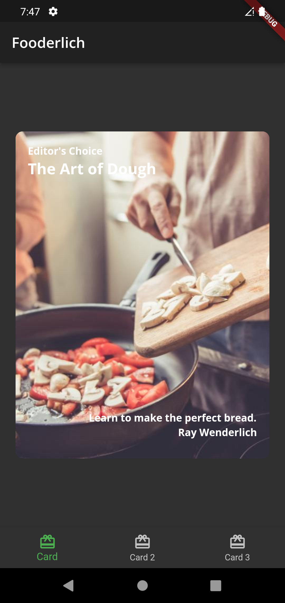
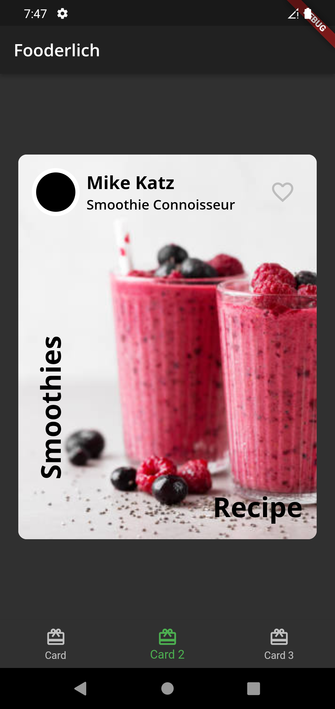
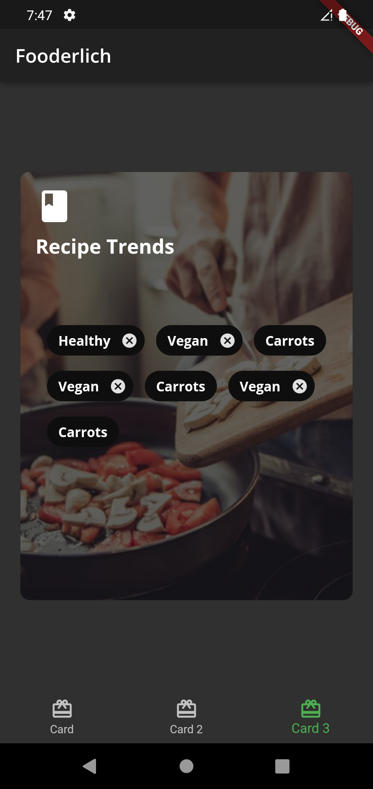

# flutter_application_test : ->

## in this project i'll work with material widget and custom widget 
___widgets like : stack , container , center , column , row___

___using theme class for providing theme for materialapp widget ...___

and so on...
## ScreenShots

---

